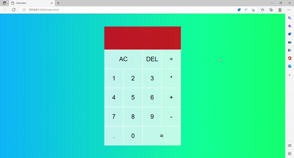

# JS-Calculator-Work-4a
<h1> Calculator</h1>

I designed a basic calculator.

There are 4 operations (+,-,*,/) and equal (=) computation in the calculator.

There are also AC and DEL functions which clears all calculations and previous number, repectively. 

After the equal (=) computation, the numbers are added to the displayed result in the original calculator project.

In my project, the enetered numbers are not added to the displayed result after the equal (=) computation.

